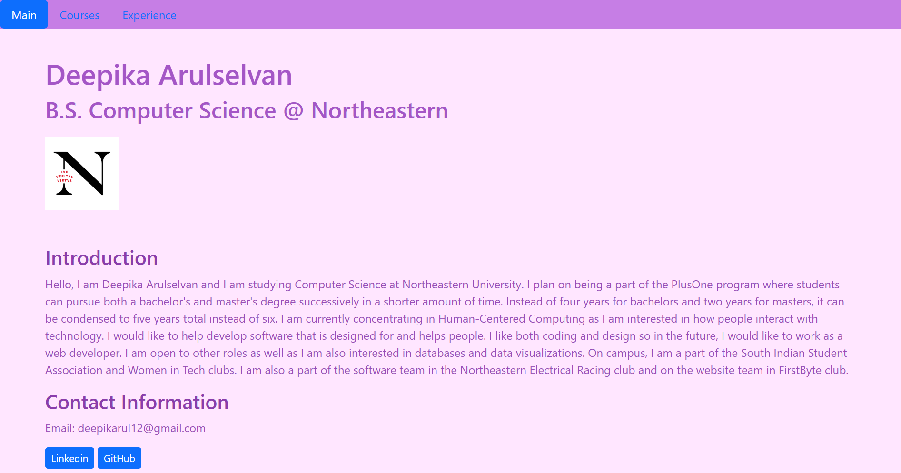
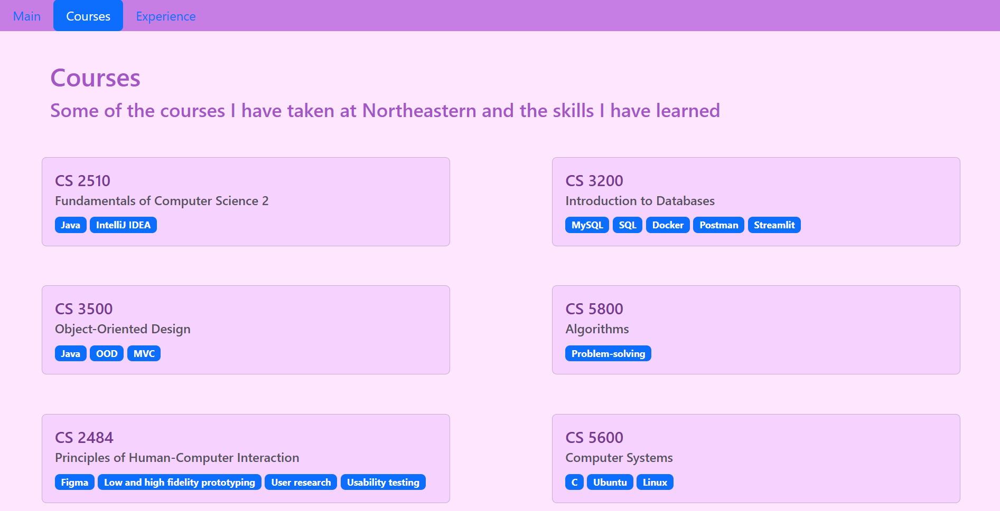
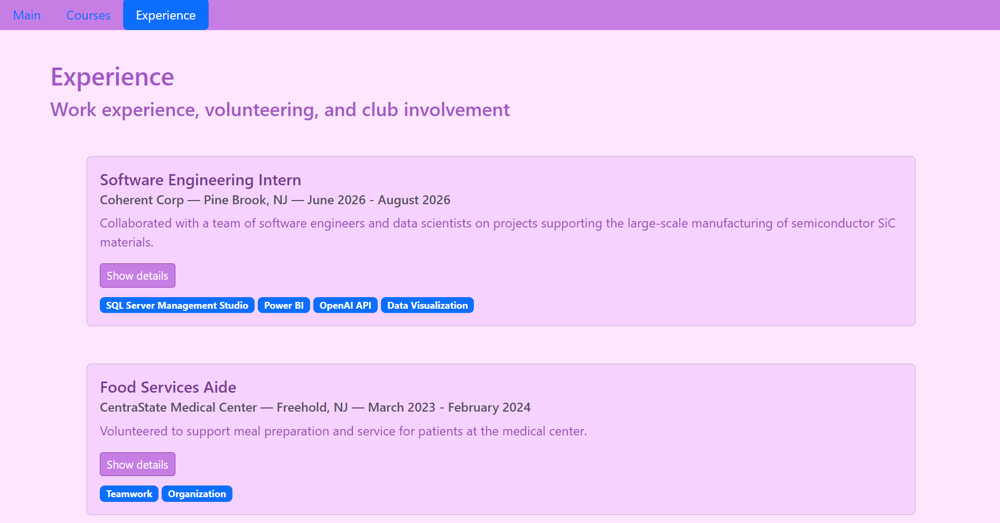
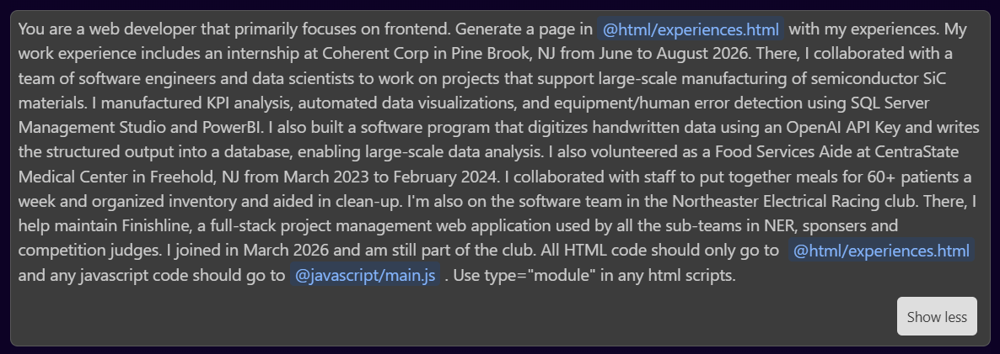

# Deepika Arulselvan Personal Home Page
A simple homepage made with HTML, CSS, and Javascript. Includes information such as my courses, skills, and experience. Created for Web Development course at Northeastern University.

**Author:** Deepika Arulselvan

**Class Link:** https://johnguerra.co/classes/webDevelopment_online_fall_2026/index.html

**Project Objective:** Implement a front-end only static homepage using vanilla HTML5, CSS3 and ES6+. 

**Original Component:** I added animations to some elements using CSS.

## Screenshots of Webpage
**Main page**

**Courses page**

**Experience page**

## Gen AI use

Only used AI to create the experience page. No AI was used to create the other two pages (main page and courses page).

I used Claude Code version Sonnet 5. This was the prompt:

